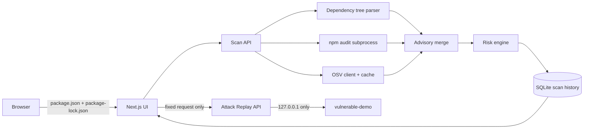

# DepShield — Dependency Risk Console

DepShield continuously assesses the npm dependency risk of a Node.js project. It parses direct and transitive packages, merges `npm audit` and OSV advisories, scores explainable risk, persists scans in SQLite, and turns the result into an ordered upgrade plan.

## Architecture



The modules are deliberately small: `src/server/scanner.ts` orchestrates, `dependency-tree.ts` discovers packages and paths, `npm-audit.ts` and `osv-client.ts` collect evidence, `advisory-merge.ts` deduplicates it, `src/lib/risk.ts` scores it, and `src/server/db.ts` persists it. Route handlers only validate requests and return structured JSON.

## Setup (PowerShell)

```powershell
cd "C:\Users\DELL\Documents\Codex\2026-08-20\build-a-full-stack-cybersecurity-project"
npm install
npm run dev
```

Open [http://localhost:3000](http://localhost:3000). Select **Scan Project**, then choose a project's `package.json` and `package-lock.json`. A lockfile is required so installed transitive versions and dependency paths are reproducible.

## Scanning workflow

1. Parse both npm manifests and walk lockfile paths.
2. Run `npm audit --json --omit=dev` in an isolated temporary directory.
3. Query OSV by exact package name and installed version; successful responses are cached for 24 hours.
4. Merge advisories by CVE/GHSA aliases, keeping sources, ranges, fixes, references, and the strongest available CVSS evidence.
5. Calculate package risk and the project security score, then persist the complete scan in SQLite.
6. Use Dependencies for evidence, Attack Replay for the controlled proof, Upgrade Plan for prioritization, and Before vs After for posture change.

Source failures are reported as recoverable scan warnings. Missing CVSS values remain visible as unknown instead of being invented. A missing lockfile returns a guided validation error and does not create an unreliable scan.

## Risk scoring

For each vulnerable dependency:

```text
CVSS × 10
+5 direct dependency
+5 no complete fix / −5 complete fix
+2 for each additional CVE (maximum +10)
clamped to 0–100
```

The project score is out of 100 and graded A–F. It combines aggregate exposure with a worst-package guardrail, so one critical package cannot disappear inside a large inventory. The upgrade plan orders higher risk first, using remediation effort as the tie-breaker: Safe Auto Fix, Minor Upgrade, Update Parent Dependency, Major Upgrade, then No Fix Available.

## Safe Attack Replay and before/after demo

`vulnerable-demo` is intentionally vulnerable and must remain local. It pins `lodash@4.17.11` for CVE-2019-10744 and remediates to `4.17.21`, the latest stable lodash 4.x pin. It binds only to `127.0.0.1:4100`. The proof uses one fixed in-memory object and removes its marker immediately; it accepts no target, payload, path, or command.

```powershell
# Terminal 1 — DepShield
npm run dev

# Terminal 2 — local teaching fixture
npm run demo:install
npm run demo:start
```

Then:

1. Scan `vulnerable-demo/package.json` and `vulnerable-demo/package-lock.json`.
2. Open Attack Replay to see CVE, CVSS, dependency path, and the fixed local flow.
3. Run the safe replay and observe the temporary marker plus verified cleanup.
4. Stop the demo, run `npm run demo:remediate`, run `npm install --ignore-scripts --audit=false` in `vulnerable-demo`, restart it, and rescan the same manifests.
5. Open Before vs After and select the vulnerable scan first and remediated scan second. The CVE disappears and score/grade improve.
6. Restore the teaching state later with `npm run demo:reset`.

Attack Replay is disabled in production by default. Never set `DEPSHIELD_ENABLE_ATTACK_REPLAY=true` on a public deployment.

## Verification

```powershell
npm run check
```

This runs ESLint, TypeScript, Vitest, and the production build.

## Deployment notes

The included `render.yaml` deploys the full Node.js service on Render. Set `DEPSHIELD_DATA_DIR` to a mounted persistent disk directory on a paid service if scan history must survive restarts; free instances use ephemeral storage. Vercel uses `/tmp` for SQLite, so its scan history is ephemeral and subprocess-based `npm audit` may be constrained by the serverless runtime. Local or persistent Render hosting is the recommended full demonstration environment.
