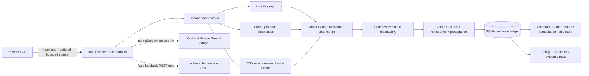

# DepShield AI

> Context-Aware Open-Source Dependency Risk Intelligence and Remediation Platform

DepShield AI turns a reproducible npm dependency inventory into explainable security decisions. It joins `npm audit`, OSV, lockfile topology, bounded static source analysis, contextual scoring, remediation simulation, scan history, policy gates, SBOM export, and a safe local Attack Replay.

This repository is designed as a clear full-stack cybersecurity project: one Next.js application, modular TypeScript security logic, SQLite snapshots, deterministic analysis, and optional grounded AI. DepShield scores and predictions are project heuristics—not industry standards or proof of exploitability.

## What it answers

- What dependency and advisory are present?
- Why is this dependency ranked above another?
- Is a supported static import path observable from supplied application source?
- Which route/module/dependency paths may be affected?
- How reliable is the available evidence?
- Which reported upgrade target should be investigated first?
- What could break after an upgrade?
- What would the posture look like under a no-write simulation?
- Did an actual rescan remove findings and attack paths?

## Architecture



The detailed implementation diagrams, trust boundaries, API table, and migrations are in [docs/ARCHITECTURE_V2.md](docs/ARCHITECTURE_V2.md). The research framing and formulas are in [docs/TECHNICAL_NOVELTY.md](docs/TECHNICAL_NOVELTY.md).

## Quick start on Windows PowerShell

Requirements: Node.js 22 and npm.

```powershell
cd "C:\Users\DELL\Documents\Codex\2026-08-20\build-a-full-stack-cybersecurity-project"
npm install
npm run dev
```

Open [http://localhost:3000](http://localhost:3000).

## What to provide to Scan Project

Use **Project folder** for the complete analysis. Select a Node.js project folder containing:

- `package.json`
- `package-lock.json`
- optional `.js`, `.jsx`, `.ts`, `.tsx`, `.mjs`, `.cjs`, `.mts`, or `.cts` application source

The browser excludes `node_modules`, `.next`, `.git`, `dist`, `build`, and `coverage`. Source analysis is bounded to 750 files, 512 KiB per file, and 8 MiB total.

Use **Manifest files only** when you do not want to supply source. Dependency and vulnerability analysis will still run, but reachability remains `UNKNOWN`.

A lockfile is required. DepShield deliberately returns a guided error instead of guessing transitive installed versions from `package.json` ranges.

After a successful scan, the UI opens the exact persisted scan (`/?scan=<id>`), and every page keeps that scan context. This prevents a completed upload from returning to an empty “Scan Project” state.

## Scan pipeline

1. Validate bounded input and parse `package.json` plus `package-lock.json`.
2. Resolve direct, transitive, runtime, dev-only, and optional dependency instances, parents, depths, and paths.
3. Run the fixed command `npm audit --json` in a temporary directory. No package install or lifecycle scripts run.
4. Query OSV in exact npm package/version batches; successful responses are cached for 24 hours.
5. Merge connected advisory aliases transitively so CVE/GHSA/OSV records are not duplicated.
6. Preserve source provenance, retrieval time, reported CVSS/ranges/fixes/references, and missing-data markers.
7. Analyze the supplied source bundle for supported imports, literal `require`, re-exports, dynamic literal imports, relative module edges, and Next.js/Express route hints.
8. Calculate per-finding confidence, dependency contextual scores, graph propagation, project security score, grade, posture radar, summaries, and attack paths.
9. Save the complete versioned scan snapshot in SQLite and return structured JSON.

An unexpected npm or OSV adapter failure becomes a failed source status and recoverable warning; the other source can still produce a scan. Missing CVSS remains unavailable instead of being invented.

## Contextual risk model

Every vulnerable dependency receives five deterministic DepShield scores from 0–100:

- **Technical risk:** reported CVSS/severity, directness, scope, additional findings, fix status, and depth.
- **Exploitability:** CVSS evidence, static reachability, curated vulnerable-API observation, exploit evidence, and vulnerability age.
- **Exposure:** reachability, route hints, vulnerable-API observation, runtime scope, parents, and path count.
- **Remediation difficulty:** patch/minor/major/update-parent/manual/no-fix class, imported APIs, parent count, conflicts, and estimated breaking risk.
- **Final priority:**

```text
0.45 × technical
+ 0.30 × exploitability
+ 0.25 × exposure
+ 0.10 × (50 − remediation difficulty)
clamped to 0–100
```

Unknown evidence is neutral in the risk calculation and lowers confidence. Each dependency exposes a **Why this score?** factor ledger with every contribution.

Finding confidence uses reported CVSS, exact installed version, known dependency path, reachability coverage, fix status, exploit-evidence status, and multi-source identifier corroboration. High risk with low confidence is intentionally different from high risk with high confidence.

The project security score is:

```text
100 − (60% × average priority of the five riskiest dependencies)
    − (20 × vulnerable dependency density)
clamped to 0–100
```

Grades: A ≥ 90, B ≥ 80, C ≥ 70, D ≥ 60, E ≥ 50, otherwise F.

### Risk propagation

```text
descendant contribution = child priority
                        × 0.55^distance
                        × reachability weight
                        × runtime weight
                        × exposure weight
                        × bounded path weight
```

Contributions use a bounded union so shared paths are not simply added repeatedly. Full structured path prefixes distinguish duplicate `name@version` instances.

## Reachability semantics

- `REACHABLE`: a supported direct static package path was observed.
- `POSSIBLY REACHABLE`: a supported path reaches a parent that introduces the vulnerable transitive dependency.
- `NOT OBSERVED`: no supported path was found in the supplied bounded source.
- `UNKNOWN`: source is absent, disabled, incomplete, unsupported, or insufficient.

`NOT OBSERVED` never means safe. Static analysis does not model reflection, generated code, runtime plugins, arbitrary aliases, middleware/auth behavior, or all function-level data flows. Function matching is enabled only for a small reviewed mapping where the API/advisory relationship is reliable.

## Product areas

- **Security Command Center:** security score, contextual risk, confidence, reachable critical findings, fixable risk, posture radar, risk matrix, trends, regressions, top paths, and highest-impact actions.
- **Dependencies / detail:** sortable health inventory, CVEs, provenance, confidence, factor ledger, dependency paths, blast radius, timeline, and upgrade impact.
- **Attack Paths:** interactive React Flow explorer with critical, reachable, exposed, direct/transitive, and fix filters.
- **Remediation Lab:** ordered plan, `SAFE PATCH`, `MINOR UPGRADE`, `MAJOR UPGRADE`, `UPDATE PARENT`, `NO FIX`, and `MANUAL REVIEW` classifications plus compatibility estimates.
- **Remediation Sandbox:** advisory-based what-if state without writing package files.
- **DepShield Analyst:** scan-scoped deterministic answers and optional evidence-constrained AI paraphrasing.
- **Security Diff:** removed, introduced, and changed findings; upgrades/downgrades; score change; and persisted attack-path deltas.
- **Policy Gate:** configurable PASS/WARNING/FAIL rules and CI exit behavior.
- **Explain This Scan:** presentation-ready, evidence-cited security story.
- **Scan History:** persisted snapshots and project-scoped comparisons.

All major UI regions retain semantic `data-ui` hooks for Impeccable refinement, including `security-score`, `context-risk`, `confidence-score`, `risk-matrix`, `attack-path`, `dependency-graph`, `remediation-sandbox`, `ai-analyst`, `security-diff`, `policy-engine`, and `evidence-pack`.

## Remediation Sandbox limitations

The sandbox removes a finding only when its recorded exact fixed version is at or below the selected exact target. It then recomputes affected risk, attack-path count, posture, summaries, and compatibility estimates while holding the application graph constant.

It does **not** run npm resolution, query the target version again, install a package, inspect peer conflicts, run tests, or modify project files. A real upgrade plus rescan is required before claiming remediation.

## DepShield Analyst

Without credentials, the analyst remains fully functional through deterministic evidence-grounded answers. Unsupported questions return exactly:

```text
Not enough evidence in the current scan.
```

Every generated remediation row includes **Explain this fix**. It opens the Analyst with the exact dependency and proposed target, then explains the recorded risk, findings estimated to disappear, compatibility uncertainty, and evidence-backed validation work.

Gemini is the recommended optional provider. Create a key in [Google AI Studio](https://aistudio.google.com/apikey), then set it only on the server. For the current PowerShell window:

```powershell
$env:GEMINI_API_KEY="paste-your-key-here"
$env:GEMINI_MODEL="gemini-3.7-flash"
$env:ENABLE_AI_ANALYST="true"
npm run dev
```

For persistent local configuration, add the same values to the ignored `.env.local` file and restart the dev server. Never use a `NEXT_PUBLIC_` prefix for the key. Vercel users should add `GEMINI_API_KEY` in Project Settings; the Render Blueprint prompts for the `sync: false` secret. Redeploy or restart after changing either platform's environment.

The existing `DEPSHIELD_AI_API_KEY`, `DEPSHIELD_AI_BASE_URL`, and `DEPSHIELD_AI_MODEL` variables remain supported for a custom OpenAI-compatible provider when Gemini is not configured.

Only normalized scan facts and allowlisted citations are sent—not source-file contents, manifests, or the API key. This evidence can still contain security-sensitive metadata such as package versions, CVEs, scan IDs, dependency paths, and source filenames. Provider output is rejected if it introduces unsupported citations, CVE/GHSA IDs, versions, scores, URLs, commands, or unsafe requests; any provider, network, or validation failure falls back deterministically.

## Policy and CI mode

The Policy Gate supports:

- block reachable critical findings;
- minimum project security score;
- maximum critical findings;
- block high-CVSS findings without a reported fixed version;
- maximum newly introduced critical findings;
- warning/failure behavior for incomplete vulnerability-source coverage.

The CI endpoint uses the most recently saved policy, or the built-in Production Security Gate when no policy exists. Baselines must belong to the same project.

Start DepShield, then run:

```powershell
npm run depshield:scan -- --project "C:\path\to\node-project" --with-source --output depshield-result.json
```

Options:

```text
--url <DepShield URL>       default: http://127.0.0.1:3000
--baseline <scan id>        project-matching persisted baseline
--with-source               upload bounded JS/TS source evidence
--output <file>             also write the JSON response
```

Process exit codes:

- `0`: policy pass or warning
- `1`: security policy failed
- `2`: scanner/input/server error

Do not use `--with-source` against an untrusted or public DepShield server; it uploads application source to that server.

## SBOM and evidence exports

From **Explain This Scan**, export:

- CycloneDX 1.6-style JSON containing components, purls, scope, dependency relationships, vulnerabilities, and DepShield properties.
- A JSON Security Evidence Pack containing scan metadata, findings, contextual risk, confidence, dependency and attack paths, reachability, remediation, policy result, summaries, provenance, optional before/after diff, and recorded local replay evidence.

Exports are generated deterministically from saved evidence. PDF export is not implemented.

## Safe local Attack Replay

`vulnerable-demo` intentionally pins historical `lodash@4.17.11` for CVE-2019-10744. It must remain local. The Express fixture binds only to `127.0.0.1:4100`, accepts no target/payload/command, uses one fixed in-memory object, removes its marker, and performs no filesystem/database/outbound-network action.

Terminal 1:

```powershell
cd "C:\Users\DELL\Documents\Codex\2026-08-20\build-a-full-stack-cybersecurity-project"
npm run dev
```

Terminal 2:

```powershell
cd "C:\Users\DELL\Documents\Codex\2026-08-20\build-a-full-stack-cybersecurity-project"
npm run demo:install
npm run demo:start
```

Demo sequence:

1. Scan the `vulnerable-demo` folder with Project folder mode.
2. Open Attack Replay and verify the recorded CVE, CVSS, version, and path.
3. Run the fixed local replay. A successful result is attached to that scan's evidence ledger.
4. Stop the fixture and run `npm run demo:remediate`.
5. Run `npm install --ignore-scripts --audit=false` inside `vulnerable-demo`.
6. Restart the fixture, rescan, and repeat the same proof.
7. Compare the two scans in Security Diff / Before vs After.
8. Restore the teaching state later with `npm run demo:reset` and regenerate the demo lockfile.

Never enable Attack Replay on a public deployment.

## Configuration

Copy values from [.env.example](.env.example) as needed:

```text
ENABLE_AI_ANALYST
ENABLE_REACHABILITY
ENABLE_REMEDIATION_SANDBOX
ENABLE_POLICY_ENGINE
ENABLE_ATTACK_REPLAY
ENABLE_SOURCE_UPLOADS
ENABLE_NVD_PROVIDER
ENABLE_GITHUB_ADVISORY_PROVIDER
DEPSHIELD_MAX_CONCURRENT_SCANS
DEPSHIELD_DATA_DIR
GEMINI_API_KEY / GEMINI_MODEL
DEPSHIELD_AI_API_KEY / BASE_URL / MODEL
```

`ENABLE_SOURCE_UPLOADS` controls Project folder mode. It defaults on outside production and off in production; enable it only when the DepShield server is local or a trusted private service because selected source text is transmitted to that server for bounded static analysis. The NVD and GitHub flags are reserved provider-state switches in this build; enabling them does not fabricate coverage or perform a request.

## Persistence and deployment

SQLite defaults to `data/depshield.sqlite`. Set `DEPSHIELD_DATA_DIR` to a writable persistent directory when one is available.

- **Local:** full scanner, durable local history, and local Attack Replay work.
- **Render:** the included `render.yaml` runs the full Node.js service. The free plan is ephemeral; attach a persistent disk and set `DEPSHIELD_DATA_DIR` for durable history.
- **Vercel:** SQLite uses `/tmp`, so history/policies/replay evidence are ephemeral and per-instance. Serverless subprocess and duration limits can constrain `npm audit`.

Local or a single persistent Render instance is the recommended full demonstration environment.

## Security and privacy boundary

This build is a trusted single-user/research console. It does not implement application authentication, tenant ownership, distributed rate limiting, or per-user scan authorization. A per-process concurrency bound limits browser scan jobs, but that is not a production abuse-control system.

Do not upload private manifests or source to a public instance. Before multi-user production use, place the service behind authenticated access, add project ownership and authorization, queue/rate-limit scan jobs, define retention/deletion, and move durable data to a production database.

## Verification

```powershell
npm run check
```

This runs ESLint, TypeScript, all Vitest tests, and the production Next.js build.

## Explicitly incomplete

- NVD adapter and GitHub Advisory adapter are not implemented; their source rows remain `skipped`.
- Static reachability is not runtime tracing, taint analysis, or proof of non-exploitability.
- The curated vulnerable-function registry is intentionally small.
- Compatibility risk does not consume complete release/changelog metadata.
- The sandbox does not resolve/install/test the proposed dependency graph.
- Gemini or another external AI provider is optional and cannot certify factual correctness; deterministic fallback remains authoritative.
- Evidence PDF export is not implemented; JSON is implemented.
- Auth, tenancy, durable distributed storage, job queues, and distributed rate limiting are not implemented.
- Vercel and free Render storage are ephemeral without an external/persistent data service.

These limits are surfaced so DepShield AI remains an explainable dependency-security intelligence platform without pretending to certify that an application is secure.
# Interactive console UI

The homepage contains a live Three.js human scan: 18,000 surface particles sampled from a locally hosted GLB, with a wireframe overlay, subtle movement, reduced-motion support, and a pause button. It loads independently of the scanner; if WebGL is unavailable, project scanning still works. Model provenance and license are in `public/models/ATTRIBUTION.md`.

The homepage evidence panels use the latest saved scan, or an explicit empty state. No example scores or vulnerability counts are inserted for appearance. The shared compact navigation and responsive tables serve all console pages.
