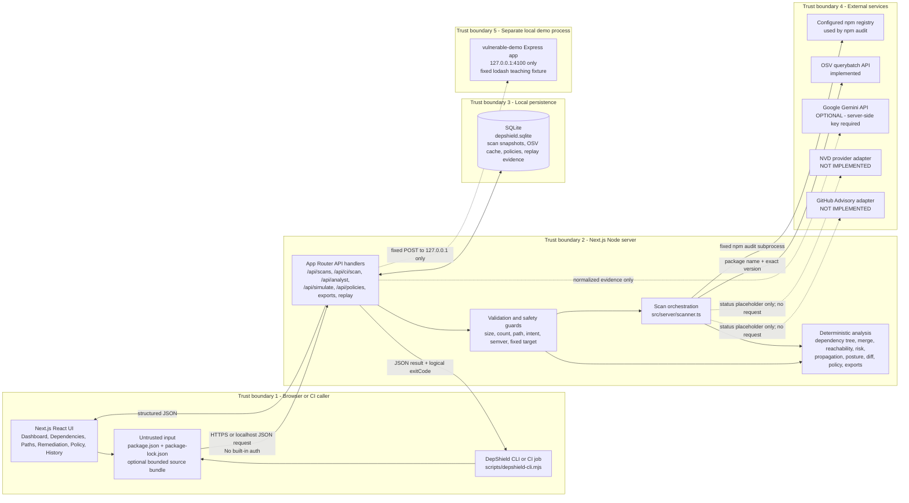
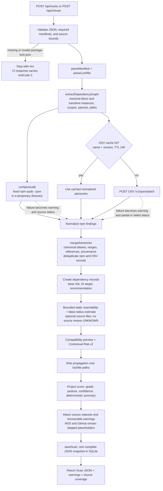
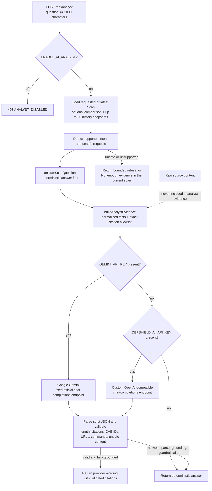
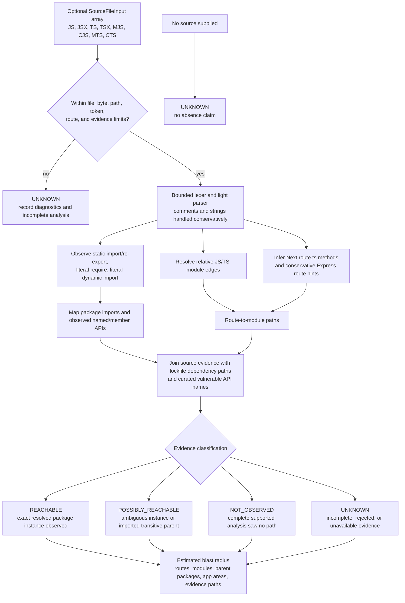
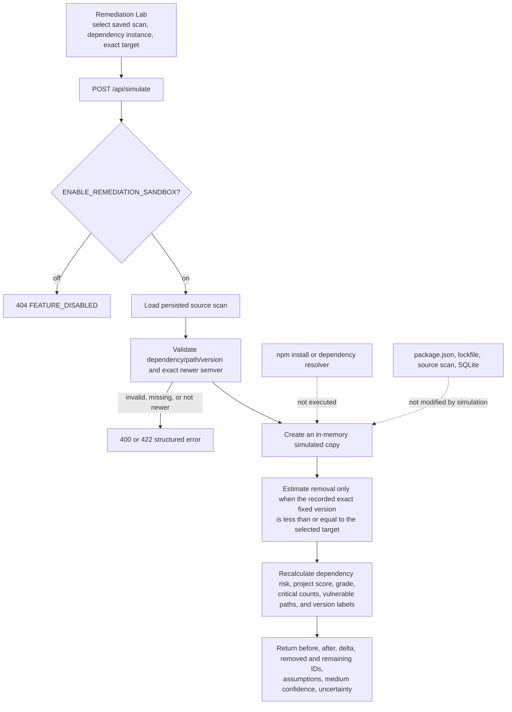
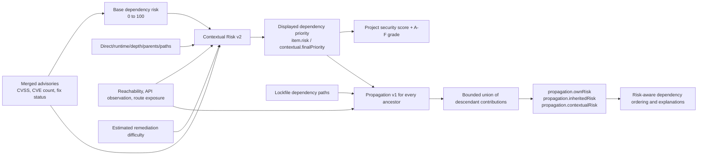
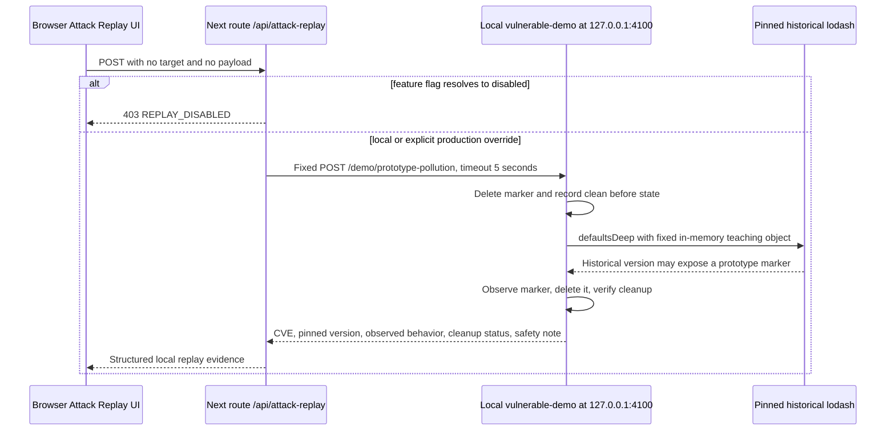
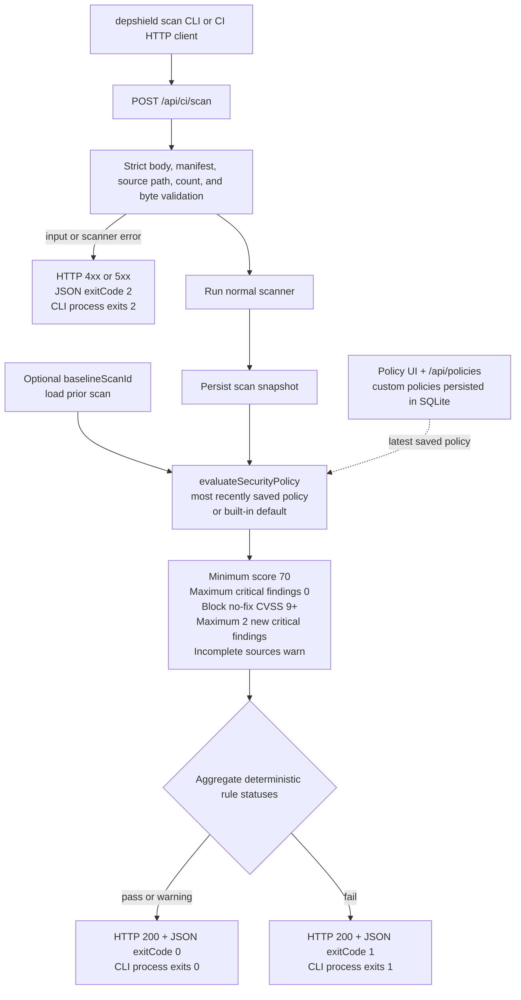
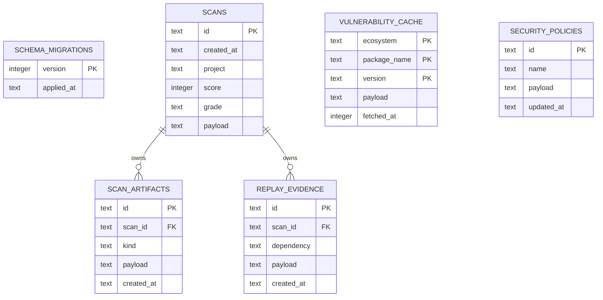

# DepShield Architecture v2

> **Implementation-aligned reference.** This document describes the code currently present in this repository. It distinguishes implemented behavior, optional behavior, schema reserved for later use, and integrations that do not exist yet.

DepShield is a single Next.js application with a Node.js scanning backend, server-rendered and client-side React views, and a local SQLite evidence ledger. A scan accepts a `package.json`, a required `package-lock.json`, and optionally a bounded bundle of JavaScript/TypeScript source files. It resolves the dependency graph, collects npm and OSV advisories, merges duplicate findings, estimates reachability and remediation impact, calculates explainable risk, saves one immutable-style scan snapshot, and returns that snapshot to the UI or CI caller.

There is currently **no application authentication, authorization, tenant isolation, or rate limiting**. The browser-to-server arrow below is therefore an untrusted public boundary unless the deployment is protected by an external identity-aware proxy or platform access control.

## Design principles

- **Deterministic core:** inventory, advisory merging, scores, policy results, diffs, SBOMs, and simulations do not require AI.
- **Evidence before claims:** source status, warnings, confidence, paths, and model caveats travel with the result.
- **Fail conservatively:** incomplete source analysis becomes `UNKNOWN`; `NOT_OBSERVED` never means safe.
- **Local-only demonstration:** Attack Replay has one fixed localhost target and one fixed, non-destructive fixture.
- **Simple persistence:** a complete scan is stored as JSON, while indexed summary columns support history views.
- **Optional enrichment:** Google Gemini or a custom compatible provider may rephrase grounded evidence, but it cannot create new facts.

---

## A. Full architecture and trust boundaries



### Boundary responsibilities

| Boundary | What crosses it | Current controls | Important limitation |
|---|---|---|---|
| Browser/CI → Next.js | Manifests, optional source text, scan IDs, questions, policy values, simulation target | JSON/type checks; path/byte bounds; per-process browser-scan concurrency bound | No built-in auth, tenant ownership, CSRF strategy, or distributed rate limiting |
| Next.js → SQLite | Derived scans, advisory cache entries, policies | Prepared statements, JSON serialization, WAL, foreign keys, migrations | A local file is not shared durable storage across serverless instances |
| Next.js → npm registry | The temporary audit project represented by uploaded manifests | Fixed `npm audit --json`; fixed timeout/buffer; temp directory removed | Registry availability and the server runtime's npm executable are external assumptions |
| Next.js → OSV | npm package names and exact installed versions | HTTPS, 15-second batch timeout, batch size 500, 24-hour cache | Dependency inventory is disclosed to OSV; partial/failure status must be reviewed |
| Next.js → optional AI | Question plus normalized, allowlisted scan evidence | API key opt-in, bounded prompt, citation validation, output safety checks, deterministic fallback | File/path names and security facts can still be sensitive; AI is not needed for scanning |
| Next.js → local demo | No user-selected target or payload; one fixed POST | Production-disabled by default, loopback URL, five-second timeout | On a hosted server, loopback means that server/container, not the user's computer |

**Authentication flow today:** none. Every route should be considered public if the deployment URL is public. Before a multi-user deployment, add authentication at the browser/API boundary, associate every scan with an owner/tenant, enforce authorization on scan IDs and exports, add rate limits, and define retention/deletion rules.

---

## B. Scan pipeline



The UI scan route accepts up to 750 source files and 8 MiB total. The reachability analyzer additionally enforces 512 KiB per file, a 260-character path, 120,000 tokens per file, 250 route hints, and 25 evidence paths per dependency. The CI route enforces the same count/total/per-file/path constraints before scanning, plus 1 MiB for `package.json` and 16 MiB for `package-lock.json`.

`npm audit` currently uses `--omit=dev`. The lockfile inventory can still include development-only dependencies, but npm's audit contribution is production-focused; OSV exact-version queries may add findings for the wider resolved inventory. That difference is reported through provenance rather than silently treated as source agreement.

---

## C. Optional AI grounding



AI is **optional**. The scanner, risk models, remediation plan, policy engine, diffs, story, SBOM, and evidence pack work without an AI key. When `GEMINI_API_KEY` is present, `src/server/analyst-provider.ts` calls Google's fixed OpenAI-compatible endpoint with `GEMINI_MODEL` (default `gemini-3.7-flash`). The key is sent only in the server-side authorization header. If Gemini is absent, the backwards-compatible `DEPSHIELD_AI_*` custom provider settings may be used.

The provider receives normalized evidence, not uploaded source contents. Normalized evidence can include package names, versions, CVE identifiers, scan IDs, dependency paths, source filenames, and posture facts; organizations should still treat this as security-sensitive metadata. External text is accepted only if every citation exactly matches the evidence allowlist and it introduces no ungrounded CVE, URL, command, payload, or target. Otherwise the deterministic answer is returned.

---

## D. Static reachability and blast radius



Implemented in `src/server/reachability.ts`, this is intentionally a bounded static analysis—not a compiler, runtime tracer, or exploitability oracle.

- `REACHABLE` means a supported static package import was observed for the resolved instance. It does not prove a vulnerable function executes.
- `POSSIBLY_REACHABLE` is used when multiple versions make resolution ambiguous or an imported parent can lead to the transitive package.
- `NOT_OBSERVED` means the complete supplied bundle contained no supported path. It is **not** a claim that the dependency is unused, unexploitable, or safe.
- `UNKNOWN` is used when source is absent, limits reject the bundle, a file is incomplete, or reliable absence cannot be established.

Evidence paths can take the form `HTTP route → source module → imported module → package` and then continue through a lockfile path to a transitive dependency. Route exposure is only a syntax-derived hint; authentication, middleware, rewrites, runtime plugins, dependency injection, generated code, reflection, and unprovided source can change the real runtime path.

`ENABLE_REACHABILITY=false` is a working scanner gate. In that mode the source bundle is not analyzed, every dependency receives conservative unknown reachability evidence, and supplied source produces a `REACHABILITY_DISABLED` warning rather than an absence claim.

---

## E. Remediation sandbox



`src/lib/remediation-sandbox.ts` is a conservative what-if calculator. It does not resolve a new npm graph, inspect peer dependency conflicts, read release notes, execute tests, install packages, or modify the uploaded project. It holds dependency paths and imports constant. A finding with no exact fixed version remains. A target that cannot be parsed as exact semver is rejected.

Compatibility information shown beside a simulation comes from the scan-time heuristic in `src/lib/compatibility.ts`; it is not proof that the upgrade is safe. The actual project must be upgraded, installed, tested, and rescanned before a remediation claim is considered verified.

---

## F. Risk calculation and propagation



### Layer 1: base dependency risk

For a vulnerable dependency:

```text
baseRisk = highestCVSS * 10
         + 5 if direct
         + 5 if not every advisory reports a fix, otherwise -5
         + 2 for each additional CVE, capped at +10

baseRisk is rounded and clamped to 0..100.
```

A dependency with no known finding has risk 0. Missing CVSS is retained as unavailable rather than invented; the numeric CVSS contribution is 0 and a `MISSING_CVSS` warning is attached. Severity metadata and other evidence can still affect contextual prioritization.

### Layer 2: contextual priority

`src/lib/contextual-risk.ts` produces deterministic technical, exploitability, exposure, remediation-difficulty, final-priority, and confidence breakdowns. Final priority uses technical risk at 45%, exploitability at 30%, exposure at 25%, plus a bounded actionability adjustment around remediation difficulty 50. Unknown evidence is neutral for risk and lowers confidence. These are DepShield heuristics, not CVSS replacements or industry standards.

The scanner writes the contextual final priority to `item.risk`. The project score is:

```text
penalty = 0.60 * average risk of the five riskiest vulnerable dependencies
        + 20 * vulnerable dependency density

securityScore = clamp(round(100 - penalty), 0, 100)
```

Grades are A ≥ 90, B ≥ 80, C ≥ 70, D ≥ 60, E ≥ 50, otherwise F.

### Layer 3: ancestor propagation

For a risky descendant under an ancestor:

```text
contribution = child priority
             * 0.55 ^ dependency distance
             * reachability weight
             * runtime weight
             * exposure weight
             * bounded path weight
```

Reachability weights are 1.00 reachable, 0.72 possibly reachable, 0.35 not observed, and 0.50 unknown. Development scope is weighted 0.45; internet-exposed paths use 1.00 and internal paths 0.75. The path multiplier is capped at 1.25. Contributions use a bounded probabilistic union so shared descendant paths are not repeatedly added as a simple sum.

The resulting `propagation.contextualRisk` helps order and explain parent-package risk. In the current build, the top-level project security score is calculated from `item.risk`, not from propagated ancestor risk; propagation is an additional decision-support view.

---

## G. Safe local Attack Replay



The separate `vulnerable-demo` Express app binds to `127.0.0.1:4100` and deliberately pins historical `lodash@4.17.11` for CVE-2019-10744. Its only proof route uses a fixed in-memory object and marker, removes the marker afterward, and performs no shell, filesystem, database, arbitrary network, or user-selected-target action. Requests from non-loopback addresses are rejected.

`/api/attack-replay` accepts selected scan, dependency, and finding identifiers only to validate the allowlisted fixture and attach evidence. It accepts no request-controlled target, URL, payload, file path, or command, and the metadata cannot change the one loopback route or fixed proof. A public deployment should keep replay disabled. The Render start command launches only Next.js, not `vulnerable-demo`, and Vercel cannot reach the process running on a user's laptop; therefore the complete replay is a **local two-process demonstration**, not a hosted feature.

The route uses `getFeatureFlags().attackReplay`. The helper reads `ENABLE_ATTACK_REPLAY` first, then `DEPSHIELD_ENABLE_ATTACK_REPLAY`, and defaults to enabled outside production and disabled in production. A deployment must opt in explicitly, but a public deployment should never do so.

---

## H. Policy gate and CI exit behavior



The JSON `exitCode` is the contract consumed by `scripts/depshield-cli.mjs`; policy failures still use HTTP 200 so an HTTP client can receive the complete scan and rule evidence. The CLI maps logical codes 0, 1, and 2 to its process exit code.

The default rules are defined in `src/lib/policy.ts`. If a baseline is absent, the new-critical rule is a warning. Policy evidence coverage reviews failed/partial configured vulnerability sources; skipped NVD/GitHub placeholders are not treated as failures. `/api/policies` stores valid custom policies, and the Policy page can preview them against a scan. The CI endpoint evaluates the most recently saved policy, falling back to `DEFAULT_SECURITY_POLICY` when none exists. A CI baseline must belong to the same project.

`ENABLE_POLICY_ENGINE=false` currently blocks `POST /api/policies`, but it does not disable `GET /api/policies`, the client-side preview, or default evaluation inside `/api/ci/scan`.

---

## Module map

| Area | Main files | Responsibility |
|---|---|---|
| Presentation shell | `src/app/layout.tsx`, `src/components/app-shell.tsx`, `src/app/globals.css` | Shared navigation, semantic layout, design tokens, responsive shell |
| Product pages | `src/app/page.tsx`, `dependencies/`, `attack-paths/`, `remediation/`, `policies/`, `story/`, `comparison/`, `history/`, `attack-replay/` | Read saved scans and compose focused feature components |
| Scan APIs | `src/app/api/scans/route.ts`, `src/app/api/ci/scan/route.ts` | Validate input, call the scanner, persist and return results; CI also evaluates policy |
| Supporting APIs | `src/app/api/analyst/route.ts`, `simulate/route.ts`, `policies/route.ts`, `attack-replay/route.ts` | Grounded answers, virtual remediation, policy persistence, fixed local replay |
| Export APIs | `src/app/api/scans/[id]/sbom/route.ts`, `evidence/route.ts` | Generate CycloneDX 1.6-style SBOM and JSON evidence pack on demand |
| Scanner orchestration | `src/server/scanner.ts` | Runs providers, merge, reachability, contextual scoring, propagation, posture, and source status assembly |
| Inventory | `src/server/dependency-tree.ts` | Parse manifest/lockfile and resolve direct/transitive instances, scopes, parents, and paths |
| Vulnerability providers | `src/server/npm-audit.ts`, `src/server/osv-client.ts`, `src/server/cvss.ts` | Fixed npm audit subprocess, cached OSV batches, CVSS parsing |
| Advisory normalization | `src/server/advisory-merge.ts` | Deduplicate aliases/advisories and preserve source provenance |
| Static evidence | `src/server/reachability.ts`, `src/server/vulnerable-functions.ts` | Conservative imports/routes/APIs, evidence paths, blast-radius estimates |
| Risk and posture | `src/lib/risk.ts`, `contextual-risk.ts`, `risk-propagation.ts`, `posture.ts` | Base score, contextual priority/confidence, ancestor propagation, project posture |
| Remediation | `src/lib/remediation.ts`, `compatibility.ts`, `remediation-sandbox.ts` | Ordered upgrade plan, estimated compatibility, virtual before/after calculation |
| Comparison and governance | `src/lib/security-diff.ts`, `policy.ts`, `security-exports.ts` | Stable diffs/anomalies, deterministic gates, SBOM/evidence/story exports |
| Analyst | `src/lib/analyst.ts`, `src/server/analyst-provider.ts` | Deterministic Q&A, normalized evidence, optional validated external wording |
| Persistence | `src/server/db.ts` | SQLite setup, migrations, scan/cache/policy access |
| Teaching fixture | `vulnerable-demo/server.js`, `vulnerable-demo/scripts/set-version.js` | Local fixed replay and vulnerable/safe dependency pin switch |
| Verification | `*.test.ts`, `package.json` scripts | Vitest unit/route tests plus lint, strict typecheck, and production build |

## HTTP route map

All handlers run in the Next.js application; scanning and SQLite routes explicitly use the Node.js runtime.

| Method and path | Purpose | Persistence | Auth today |
|---|---|---|---|
| `GET /api/scans` | List up to 50 latest scans | Reads SQLite | None |
| `GET /api/scans?id=...` | Fetch one complete scan | Reads SQLite | None |
| `POST /api/scans` | Browser scan, save, return | Writes scan/cache | None |
| `POST /api/ci/scan` | Strict scan plus latest-saved/default policy and logical exit code | Writes scan/cache | None |
| `GET /api/scans/[id]/sbom` | Download generated CycloneDX-style JSON | Reads scan; export is computed | None |
| `GET /api/scans/[id]/evidence?before=...` | Download evidence pack with optional baseline diff | Reads scans; export is computed | None |
| `POST /api/analyst` | Deterministic/optional-AI answer grounded in saved scans | Reads scans | None |
| `POST /api/simulate` | Virtual upgrade simulation | Reads scan; does not save simulation | None |
| `GET /api/policies` | List saved custom policies | Reads SQLite | None |
| `POST /api/policies` | Validate and save a policy | Writes SQLite | None |
| `POST /api/attack-replay` | Validate scan evidence, call the fixed localhost fixture | Writes replay evidence | None |

---

## Data model and migrations

`src/server/db.ts` opens one `better-sqlite3` database at:

1. `DEPSHIELD_DATA_DIR/depshield.sqlite` when configured;
2. the operating-system temporary directory under `depshield/` when `VERCEL` is set; or
3. `<process.cwd()>/data/depshield.sqlite` otherwise.

WAL mode and foreign keys are enabled. Migrations are numbered, applied inside a transaction, and recorded in `schema_migrations`.



### Applied schema versions

- **Migration 1:** `scans` and `vulnerability_cache`.
- **Migration 2:** `security_policies`, `scan_artifacts`, `replay_evidence`, and the scan-artifact index.

The `scans.payload` column contains the complete `Scan` JSON. The indexed `created_at`, `project`, `score`, and `grade` fields keep history queries simple. This snapshot-first model is easy to explain and tolerates newly optional JSON fields, but it is not optimized for cross-project SQL analytics.

The OSV cache key is `(ecosystem='npm', package_name, version)` and entries are accepted for 24 hours. Expired entries are ignored; a cleanup helper exists.

`scan_artifacts` remains schema-reserved: SBOMs and evidence packs are generated deterministically from saved scans on request rather than stored. `replay_evidence` is active: the fixed Attack Replay route records a successful local observation against the selected scan, and evidence-pack export includes those records. Simulations remain non-persistent by design.

Future schema changes should continue as numbered, idempotent migrations. A later normalized model could add project/tenant ownership, dependency instances, graph edges, findings, provenance, reachability paths, simulations, and artifact retention while retaining a compatibility reader for historical `payload` snapshots.

---

## Feature flags and integration status

Environment values are enabled only by the case-insensitive string `true`; otherwise the listed default applies.

| Flag | Default | Current effect | Integration caveat |
|---|---:|---|---|
| `ENABLE_AI_ANALYST` | On | Gates `POST /api/analyst` | Gemini requires server-only `GEMINI_API_KEY`; a custom provider can use `DEPSHIELD_AI_API_KEY`; without either key the answer is deterministic |
| `ENABLE_REACHABILITY` | On | Gates bounded source reachability inside `scanProject` | When off, supplied source is not analyzed; dependencies receive unknown evidence and a warning records the disabled analysis |
| `ENABLE_REMEDIATION_SANDBOX` | On | Gates `POST /api/simulate` | Simulation remains virtual even when enabled |
| `ENABLE_POLICY_ENGINE` | On | Gates saving via `POST /api/policies` | Does not gate policy reads, UI preview, or default CI evaluation |
| `ENABLE_ATTACK_REPLAY` | On outside production, off in production | Primary flag checked by `POST /api/attack-replay` through the helper | Keep false on public deployments |
| `DEPSHIELD_ENABLE_ATTACK_REPLAY` | Off in production | Backward-compatible replay flag used when `ENABLE_ATTACK_REPLAY` is unset | Keep false on public deployments |
| `ENABLE_NVD_PROVIDER` | Off | Changes NVD skipped-status message | **No NVD HTTP adapter is implemented; no NVD data is collected** |
| `ENABLE_GITHUB_ADVISORY_PROVIDER` | Off | Changes GitHub skipped-status message | **No GitHub Advisory HTTP adapter is implemented; no GitHub data is collected** |

AI is optional. NVD and GitHub are not optional working providers—they are unimplemented adapter placeholders. Enabling their flags must not be interpreted as enabling enrichment.

---

## Failure behavior

| Condition | Current behavior | Interpretation/action |
|---|---|---|
| Missing `package-lock.json` | Browser/CI scan stops with 422; CI returns `exitCode: 2` | Generate a lockfile; DepShield does not guess transitive versions |
| Invalid manifest/JSON | Scan stops with 400; unexpected scanner failures return 500 | Fix the request; no scan is saved before successful orchestration |
| npm audit command/error/invalid JSON | Provider returns `failed`, warning is attached, OSV path continues | Results have reduced coverage; do not interpret absent npm findings as clean |
| OSV timeout/HTTP failure | Cached/fetched batches remain; source becomes `partial` or `failed`; warning attached | Review `sourceStatus` and retry; cache can preserve earlier exact-version evidence |
| NVD or GitHub flags | Source remains `skipped`; message states adapter is absent | No data was queried; this is not an API outage |
| Duplicate advisory | Canonical aliases and source records are merged | One normalized finding retains multi-source provenance |
| Missing CVSS | Score is not invented; CVSS availability is false and warning is attached | Severity/source text remains evidence; numerical conclusions have lower confidence |
| No reported fix | Recommendation remains partial/no-fix and sandbox will not remove that finding | Isolate, replace, remove, update a parent, or perform manual vendor review |
| No source supplied | Reachability is `UNKNOWN` | Inventory/vulnerability scan is still valid; runtime exposure is not established |
| Source limit, unsafe path, dynamic/unresolved construct | Analyzer records diagnostics and incomplete/unknown evidence; CI rejects unsafe/bounded input earlier where possible | Reduce/clean the bundle or use runtime analysis outside DepShield |
| Optional AI unavailable or invalid | Deterministic answer is returned | Scanning and evidence remain available; there is no AI-only dependency |
| Invalid simulation target | 400/422; no file or scan is changed | Select an exact newer semver supported by recorded advisory evidence |
| Replay disabled | 403 | Run the two local processes for the teaching demo |
| Local demo absent/unresponsive | 503 after a five-second timeout | Start `npm run demo:start` locally; do not change the target |
| SQLite initialization/write failure | Request fails; server logs contain the operational error | Restore writable persistent storage; never assume history was saved |
| Policy fail | CI HTTP response is 200 with `exitCode: 1` and rule evidence | The CLI exits 1 and should block the pipeline |
| CI validation/scanner error | CI returns structured `exitCode: 2` with 4xx/5xx | Treat as tool/evidence failure, not as a security-policy pass |

If both vulnerability providers fail, the dependency graph can still be returned and the numerical score can look high because no known findings were available. **Never read the score without `sourceStatus`, warnings, and confidence.** The policy's incomplete-source rule exists to keep degraded evidence visible.

---

## Safety and privacy

### What DepShield deliberately does

- Writes supplied manifests only to a unique OS temporary directory for the fixed npm audit command, then recursively removes that directory in `finally`.
- Invokes a fixed executable/argument list; it does not accept an arbitrary shell command and does not run `npm install` or package lifecycle scripts.
- Sends only npm package names and exact versions to OSV and caches the normalized result.
- Keeps raw uploaded source in request memory for bounded static analysis. The saved `Scan` contains derived filenames, paths, imports, functions, routes, and risk evidence—not raw source contents.
- Sends only normalized evidence to the optional AI provider and validates the returned citations and identifiers.
- Keeps the vulnerable proof-of-concept isolated to a fixed localhost Express route with a fixed in-memory payload and cleanup.

### Risks an operator must address

- **Unauthenticated data access:** scan history, dependency names, vulnerability IDs, internal source paths, exports, policies, and analyst answers are accessible to anyone who can reach the service.
- **Sensitive software inventory:** manifests and dependency versions reveal technology choices; OSV/npm calls disclose inventory to external services.
- **Optional AI egress:** normalized evidence may reveal internal paths and security posture even though raw source is excluded.
- **Denial of service:** bounds reduce parser cost, but scan, npm subprocess, SQLite, and external requests still need per-user rate limits, concurrency limits, and request-body limits at the proxy/platform.
- **Retention:** SQLite keeps scan payloads until manually removed; no per-user deletion or retention job is implemented.
- **Reference links:** vulnerability references originate from providers and should be rendered as external, untrusted links.

For any shared deployment, add identity, tenant-scoped row ownership, scan-ID authorization, encrypted transport, secrets management, rate limits, audit logging, retention/deletion, and a privacy notice before accepting proprietary source.

---

## Deployment constraints

### Local development — complete reference environment

Local Node.js 22 is the most complete setup because it provides a writable filesystem, SQLite, the npm executable, outbound registry/OSV access, and the optional second localhost demo process. Run Next.js and `vulnerable-demo` in separate terminals. The demo remains bound to loopback.

### Vercel

- The App Router handlers require the Node.js runtime; Edge runtime is not compatible with `better-sqlite3` or the npm subprocess.
- `src/server/db.ts` intentionally places SQLite under the OS temporary directory when `VERCEL` exists. `/tmp` is ephemeral, instance-local, and not a durable scan-history database. Deployments, cold starts, instance replacement, and horizontal scale can lose or split history/cache state.
- Native `better-sqlite3` must build for the Vercel runtime. A single local SQLite file is not a shared multi-instance database and can encounter contention under concurrent scans.
- `npm audit` assumes the deployed function has an npm executable, writable temporary space, outbound registry access, and enough time. The route declares `maxDuration = 180`, while the subprocess has a 120-second timeout, but platform plan/runtime limits still apply. Serverless execution is therefore best-effort, not equivalent to a local scan runner.
- Attack Replay cannot reach a user's `127.0.0.1`; the vulnerable demo is not part of the Vercel deployment and should remain disabled.
- Use an external durable database/object store and a controlled worker or local CI runner for production-grade history and scanning.

### Render

- `render.yaml` creates one Node 22 web service on the free plan with `npm ci && npm run build`, `npm start`, and replay disabled.
- The free service filesystem is ephemeral and the service may sleep/restart. Scan history and OSV cache are not durable across replacement.
- For one persistent instance, attach a paid persistent disk and set `DEPSHIELD_DATA_DIR` to its mount, for example `/var/data/depshield`. SQLite still does not support horizontally scaled writers sharing a normal network filesystem safely.
- The start command launches only Next.js. It does not install or start `vulnerable-demo`; hosted Attack Replay should remain unavailable.
- Runtime npm audit still needs outbound registry access, writable temp space, the npm executable, and capacity for a long request. A background job/queue would be safer for production-scale scanning.

### Recommended production split

For a classroom/demo deployment, one persistent Render instance or local execution is easy to explain. For production, separate the UI/API from a bounded scan worker, use durable multi-tenant storage, authenticate every request, queue scans, apply concurrency/rate limits, and store evidence artifacts with explicit retention. That future split should preserve the deterministic scanner interfaces rather than moving security decisions into the UI or AI provider.

---

## Explicit non-features and research-grade limits

- **NVD adapter:** not implemented. The type and feature flag exist only for source-status visibility.
- **GitHub Advisory adapter:** not implemented. There is no token exchange, GraphQL/REST client, pagination, or advisory normalization path.
- **AI vulnerability discovery:** not implemented and not desired; AI only optionally explains already-normalized evidence.
- **Runtime reachability/taint analysis:** not implemented. Static route/import evidence cannot prove exploitability or absence.
- **Resolved upgrade sandbox:** not implemented. The current sandbox does not install, solve peer dependencies, run tests, or execute the upgraded application.
- **Hosted Attack Replay:** intentionally not implemented. The proof remains a local fixed teaching fixture.
- **Authentication and tenancy:** not implemented.
- **Durable distributed persistence:** not implemented; current storage is a local SQLite file.
- **Artifact retention:** `scan_artifacts` is schema-reserved; SBOM and evidence packs are generated on demand rather than stored. Successful local replay evidence is persisted and included in evidence-pack exports.
- **Named CI policy selection:** not implemented; CI uses the most recently saved policy or the built-in default rather than accepting an arbitrary policy ID.

These limits do not make the deterministic evidence useless; they define its correct claim: DepShield prioritizes known dependency risk using uploaded lockfile state, provider evidence, and conservative static observations. It does not certify that an application is secure.

## One-minute interview explanation

“The browser or CI sends a package manifest, lockfile, and optionally bounded source files to a Next.js Node API. The backend reconstructs every installed dependency path, runs a fixed npm audit command, queries OSV by exact package version with a SQLite cache, and deduplicates the advisories while keeping provenance. A conservative static analyzer connects routes and modules to package imports, then deterministic models calculate dependency priority, project posture, propagation, remediation choices, and policy results. The complete scan is saved as a SQLite JSON snapshot for history, comparisons, SBOMs, and evidence exports. AI is optional and can only rephrase allowlisted scan facts. The deliberately vulnerable Attack Replay is a separate localhost-only Express process with one fixed, non-destructive demonstration. The major production gaps are authentication, durable distributed storage, job isolation, and the not-yet-implemented NVD and GitHub advisory adapters.”
